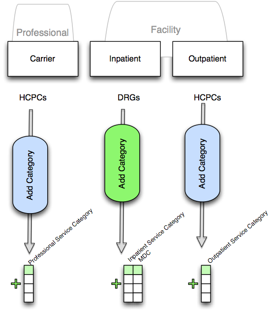
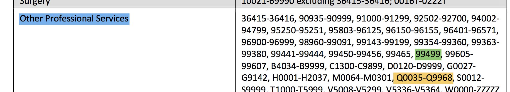

# cms-code-categorizer-python
##  A set of python functions for categorizing HCPC codes and DRG codes



## Motivation:
Medical claims data often comes with a set of codes:
  * ICD-9 Procedure Codes
  * HCPC/CPT Procedure Codes
  * DRG Codes

These codes are useful for allowing health systems and payers to understand cost.
However as these codes are at a granular level sometimes there is a need to agglomerate
them into coarser-grain categories.

Once established, these categories represent a new dimension upon which standard reporting
may be run (e.g. `select sum(cost),category from outpatient_billing group by category`).

This package is a set of python functions that take in these codes and provide
a category according to a deterministic mapping.

## Mapping Types
Though the concept of a mapping is sufficiently easy to understand, there will
be many options to choose from due to the multiplicative nature of the type of mapping
and the source and version of the mapping rules.

The rules by which these categories are established can be found in many publications.  

### Source(s)
Our current source for this library is: 
  * **HCIC Source**:  [Health Care Cost and Utilization Report: 2011](http://www.healthcostinstitute.org/files/HCCI_HCCUR2011.pdf)

### Mapping Type
Currently we support:
  * DRG -> MDC (Medical Diagnostic Category)
  * DRG -> Inpatient Service Category
  * HCPC -> Outpatient Service Category
  * HCPC -> Professional Services Category (for carrier files) 

## Function Mapping and API

The following tables list the relevant python functions found in `categorizer.py` that you, as a developer, will need.  All you need to do is pass in your appropriate code.

The API is fairly simple and relies on strings:
```
category = carrier_categorizer_by_hcpc("0016T")
```

The above snippet of code will return the category `Surgery` (as a string) as per the HCIC2011 specification.

### DRG
<table>
  <th>Source</th>
  <th>Inpatient Service Category</th>
  <th>Medical Diagnostic Category</th>
  <tr>
    <td>HCIC2011</td>
    <td><code>inpatient_service_category_by_drg(drg)</code></td>
    <td><code>inpatient_mdc_category_by_drg(drg)</code></td>
  </tr>
</table>

### HCPC
<table>
  <th>Source</th>
  <th>Outpatient Service Category</th>
  <th>Professional Services Category</th>
  <tr>
    <td>HCIC2011</td>
    <td><code>outpatient_categorizer_by_hcpc(hcpc)</code></td>
    <td><code>carrier_categorizer_by_hcpc(hcpc)</code></td>
  </tr>
</table>

## Lower level API and Creating and Contributing your own Mapping
If you have your own mappings you want to create, then there are lower-level APIs that may be of use to you.

In the below snapshot, taken from [Health Care Cost and Utilization Report: 2011](http://www.healthcostinstitute.org/files/HCCI_HCCUR2011.pdf), you can see the definition of the category 'Other Professional Services' (in blue) includes both individual HCPC codes (in green) and HCPC ranges (in yellow).  

This highlights the nature of most mappings, and is the key to creating your own categorizer function.



The takeaway here is that you need to 

1. create your own mapping with python dictionaries that have the three things we've just highlighted:
    1. a category name
    2. a list of individual codes
    3. a list of ranges
2. utilize the `categorizer_by_rules` higher-order function to generate your own function.

## Example

```python
my_mapping = [
  {
  'category' : "Sublime Medical Arcana",
  'individual_codes':  [( "99465"),( "99499")],
  'code_ranges': [("36415","36416"),
                  ( "PA01X","PA99X"),  # LOOK at THIS RANGE
                  ( "V5008","V5299"),
                  ( "V5336","V5364"),
                  ( "W0000","ZZZZZ")]
  },
  # .... you can have MANY categories in your own mapping
]


# categorizer_by_rules is a higher-order function that takes an array
# of dictionares and returns another function, the actual function,
# that does the categorization based on the rules captured in
# the dictionary set
mycategorizer = categorizer_by_rules(my_mapping)

# Now I can use mycategorizer 
# to get the category for the code PA11X
# which is in the range PA01X to PA99X
c = mycategorizer("PA11X")

# c will be the string "Sublime Medical Arcana"
# because "PA11X" was found in one of the ranges 
# listed in the code_ranges slot of the dictionary
```
